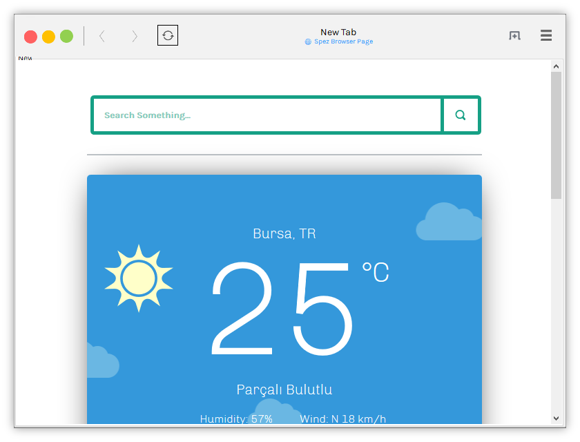

#   Spez Browser
Spez Browser is a web browser that built with VB.NET. It uses S.B.E. rendering engine, that is based on GeckoFX and XULRunner.

## Features

- GNOME Web like interface *(like Hide tab header when tab count is one, dialogs move main window, etc.)*.
- Customiziable Settings like Homepage and Theme.
- Private Browsing.
- **NEW:** Import bookmarks quickly from Firefox or Chrome *(Manually)*.
- Faster than Chrome ***(Tested)***.
- Quickly installation *(No asking for installation path, alike to Firefox Installer a bit.)*.
- Multi language *(**NEW:** Also sets language automaticly in first opening.)*
- **NEW:** Website Security control *(Green for https:// link, Gray for http:// link)*.

**Download from** *(Turkish site)* https://spezcomputer.weebly.com/spez-browser---304ndir-bilgisayar-standart-suumlruumlm.html
